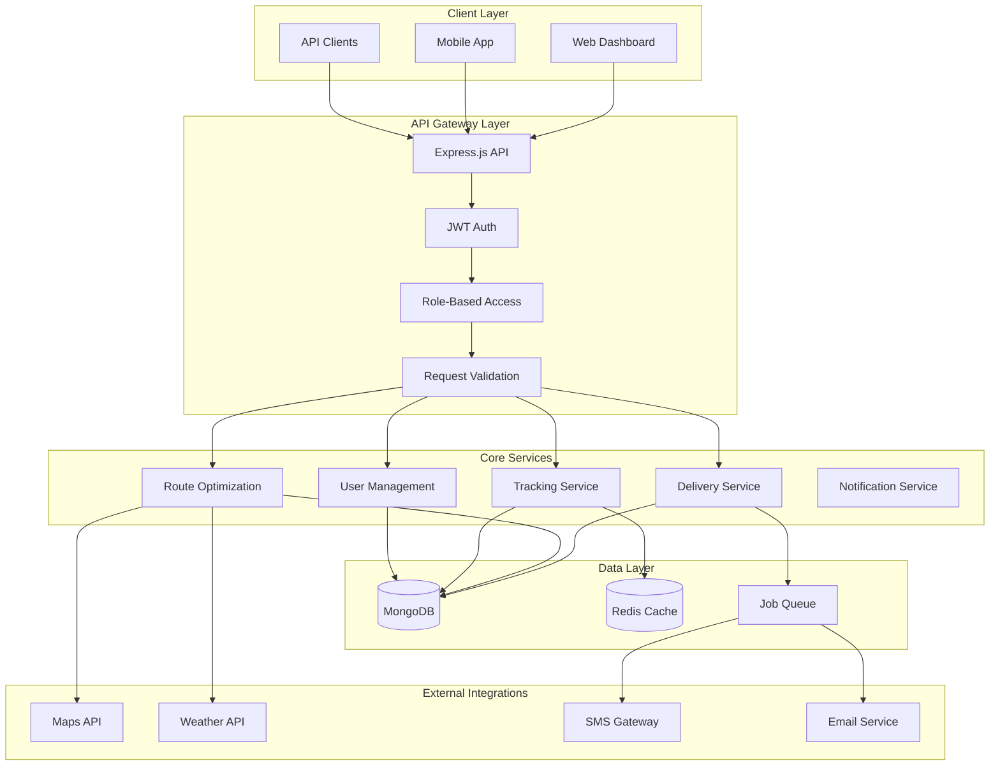
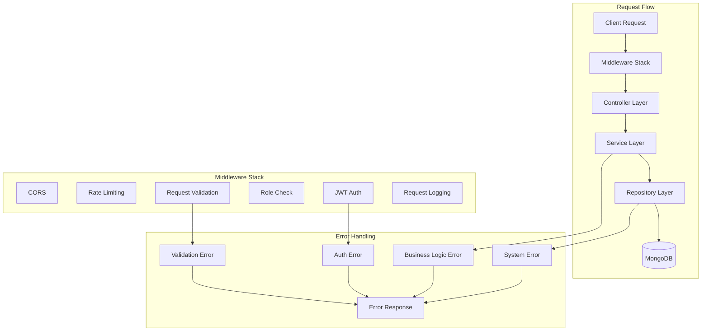

# 🚚 Logistics Management Backend API

A production-ready logistics management system built with **Node.js**, **Express**, and **MongoDB**. This enterprise-grade platform provides real-time delivery tracking, intelligent route optimization, and comprehensive role-based access control for modern logistics operations.

## ✨ Core Features

- **Real-time Delivery Tracking** - Live GPS tracking with status updates and ETA calculations
- **Intelligent Route Optimization** - AI-powered route planning with traffic and weather considerations
- **Multi-Role Access Control** - Admin, Planner, and Driver roles with granular permissions
- **RESTful API Architecture** - Clean, documented endpoints with comprehensive error handling
- **MongoDB Integration** - Scalable NoSQL database with optimized queries and indexing
- **JWT Authentication** - Secure token-based authentication with role-based authorization
- **Docker Deployment** - Containerized environment with Docker Compose for easy deployment
- **CI/CD Ready** - GitHub Actions workflow for automated testing and deployment

## 🏗️ Architecture & Design Patterns

### High-Level System Architecture



### Role-Based Access Control Matrix

| Role        | Delivery Management | Route Planning | Driver Management | User Management | Analytics       | System Settings |
| ----------- | ------------------- | -------------- | ----------------- | --------------- | --------------- | --------------- |
| **Driver**  | View Assigned       | View Routes    | Profile Only      | None            | Personal Stats  | None            |
| **Planner** | Create & Update     | Full Access    | View All          | View Drivers    | Route Analytics | None            |
| **Admin**   | Full Access         | Full Access    | Full Access       | Full Access     | Full Analytics  | Full Access     |

### API Architecture Patterns



## 🚀 Quick Start

### Prerequisites

- **Node.js** 18+
- **MongoDB** 6.0+
- **Redis** 7.0+ (optional, for caching)
- **Docker** & **Docker Compose** (for containerized deployment)

## 🔧 Core Technical Implementation

### Event-Driven Architecture with Message Queues

Our logistics platform implements a sophisticated event-driven architecture to handle high-frequency delivery updates and real-time notifications:

```typescript
// Event Bus Implementation
@Injectable()
export class EventBus {
  private readonly eventEmitter: EventEmitter;
  private readonly messageQueue: Bull.Queue;
  private readonly eventHandlers: Map<string, EventHandler[]> = new Map();

  constructor(
    private readonly redisService: RedisService,
    private readonly logger: Logger
  ) {
    this.eventEmitter = new EventEmitter();
    this.messageQueue = new Bull("event-queue", {
      redis: process.env.REDIS_URL,
      defaultJobOptions: {
        removeOnComplete: 100,
        removeOnFail: 50,
        attempts: 3,
        backoff: { type: "exponential", delay: 2000 },
      },
    });

    this.initializeEventProcessors();
  }

  async publishEvent<T>(eventName: string, payload: T): Promise<void> {
    // Emit for real-time subscribers
    this.eventEmitter.emit(eventName, payload);

    // Queue for persistent processing
    await this.messageQueue.add(eventName, {
      payload,
      timestamp: Date.now(),
      eventId: this.generateEventId(),
    });

    // Store in event log for audit
    await this.storeEventLog(eventName, payload);
  }

  private async initializeEventProcessors(): Promise<void> {
    // Process delivery status updates
    this.messageQueue.process("delivery.status.updated", async (job) => {
      const { payload } = job.data;

      await Promise.all([
        this.updateDeliveryAnalytics(payload),
        this.notifyStakeholders(payload),
        this.updateExternalSystems(payload),
      ]);
    });

    // Process route optimization requests
    this.messageQueue.process("route.optimization.requested", async (job) => {
      const { payload } = job.data;

      const optimizedRoute = await this.routeOptimizationService.optimize(
        payload
      );
      await this.publishEvent("route.optimization.completed", optimizedRoute);
    });
  }
}
```

### Advanced Caching Strategy with Redis

Multi-layered caching implementation for optimal performance:

```typescript
// Intelligent Caching Service
@Injectable()
export class CacheService {
  private readonly redis: Redis;
  private readonly localCache: Map<string, CacheEntry> = new Map();
  private readonly cacheConfig: CacheConfig;

  constructor() {
    this.redis = new Redis(process.env.REDIS_URL);
    this.cacheConfig = this.loadCacheConfig();
  }

  async get<T>(key: string, fallback?: () => Promise<T>): Promise<T | null> {
    // L1: Local memory cache (fastest)
    const localEntry = this.localCache.get(key);
    if (localEntry && !this.isExpired(localEntry)) {
      return localEntry.data as T;
    }

    // L2: Redis cache
    const redisData = await this.redis.get(key);
    if (redisData) {
      const parsed = JSON.parse(redisData);
      this.localCache.set(key, {
        data: parsed,
        timestamp: Date.now(),
        ttl: this.cacheConfig.defaultTTL,
      });
      return parsed;
    }

    // L3: Fallback to data source
    if (fallback) {
      const data = await fallback();
      await this.set(key, data);
      return data;
    }

    return null;
  }

  async set<T>(key: string, data: T, ttl?: number): Promise<void> {
    const cacheTTL = ttl || this.cacheConfig.defaultTTL;

    // Update local cache
    this.localCache.set(key, {
      data,
      timestamp: Date.now(),
      ttl: cacheTTL,
    });

    // Update Redis cache
    await this.redis.setex(key, cacheTTL, JSON.stringify(data));
  }

  private isExpired(entry: CacheEntry): boolean {
    return Date.now() - entry.timestamp > entry.ttl * 1000;
  }
}
```

### Database Optimization with MongoDB Aggregation

Sophisticated query optimization for complex logistics data:

```typescript
// Optimized Delivery Repository
@Injectable()
export class DeliveryRepository {
  constructor(
    private readonly database: Database,
    private readonly cacheService: CacheService
  ) {}

  async findDeliveriesWithOptimization(
    filters: DeliveryFilters,
    options: QueryOptions
  ): Promise<DeliveryWithAnalytics[]> {
    const cacheKey = this.generateCacheKey(filters, options);

    return this.cacheService.get(cacheKey, async () => {
      const pipeline = [
        // Match stage for filtering
        { $match: this.buildMatchStage(filters) },

        // Lookup related data
        {
          $lookup: {
            from: "drivers",
            localField: "driverId",
            foreignField: "_id",
            as: "driver",
          },
        },

        // Lookup route information
        {
          $lookup: {
            from: "routes",
            localField: "routeId",
            foreignField: "_id",
            as: "route",
          },
        },

        // Calculate analytics
        {
          $addFields: {
            estimatedDuration: {
              $divide: [
                { $arrayElemAt: ["$route.distance", 0] },
                { $arrayElemAt: ["$route.averageSpeed", 0] },
              ],
            },
            efficiencyScore: {
              $multiply: [
                { $divide: ["$actualDuration", "$estimatedDuration"] },
                100,
              ],
            },
          },
        },

        // Sort and paginate
        { $sort: options.sort || { createdAt: -1 } },
        { $skip: options.skip || 0 },
        { $limit: options.limit || 50 },
      ];

      return this.database
        .collection("deliveries")
        .aggregate(pipeline)
        .toArray();
    });
  }

  async getDeliveryAnalytics(
    tenantId: string,
    dateRange: DateRange
  ): Promise<DeliveryAnalytics> {
    const pipeline = [
      {
        $match: {
          tenantId,
          createdAt: { $gte: dateRange.start, $lte: dateRange.end },
        },
      },

      {
        $group: {
          _id: {
            status: "$status",
            date: { $dateToString: { format: "%Y-%m-%d", date: "$createdAt" } },
          },
          count: { $sum: 1 },
          totalDistance: { $sum: "$distance" },
          averageDuration: { $avg: "$duration" },
        },
      },

      {
        $group: {
          _id: "$_id.date",
          statuses: {
            $push: {
              status: "$_id.status",
              count: "$count",
              totalDistance: "$totalDistance",
              averageDuration: "$averageDuration",
            },
          },
        },
      },
    ];

    return this.database.collection("deliveries").aggregate(pipeline).toArray();
  }
}
```

### Real-time WebSocket Integration

WebSocket implementation for live delivery tracking and notifications:

```typescript
// WebSocket Manager
@Injectable()
export class WebSocketManager {
  private readonly wss: WebSocketServer;
  private readonly clients: Map<string, WebSocket> = new Map();
  private readonly subscriptions: Map<string, Set<string>> = new Map();

  constructor(
    private readonly eventBus: EventBus,
    private readonly authService: AuthService
  ) {
    this.wss = new WebSocketServer({ port: 8080 });
    this.initializeWebSocketServer();
    this.subscribeToEvents();
  }

  private initializeWebSocketServer(): void {
    this.wss.on(
      "connection",
      async (ws: WebSocket, request: IncomingMessage) => {
        try {
          // Authenticate connection
          const token = this.extractToken(request);
          const user = await this.authService.verifyToken(token);

          const clientId = user.id;
          this.clients.set(clientId, ws);

          // Handle client messages
          ws.on("message", (message: string) => {
            this.handleClientMessage(clientId, JSON.parse(message));
          });

          // Handle client disconnect
          ws.on("close", () => {
            this.handleClientDisconnect(clientId);
          });

          // Send initial connection confirmation
          ws.send(
            JSON.stringify({
              type: "connection_established",
              clientId,
              timestamp: Date.now(),
            })
          );
        } catch (error) {
          ws.close(1008, "Authentication failed");
        }
      }
    );
  }

  private handleClientMessage(clientId: string, message: any): void {
    switch (message.type) {
      case "subscribe_delivery":
        this.subscribeToDelivery(clientId, message.deliveryId);
        break;
      case "unsubscribe_delivery":
        this.unsubscribeFromDelivery(clientId, message.deliveryId);
        break;
      case "ping":
        this.sendToClient(clientId, { type: "pong", timestamp: Date.now() });
        break;
    }
  }

  private subscribeToEvents(): void {
    // Subscribe to delivery updates
    this.eventBus.subscribe("delivery.status.updated", (event) => {
      this.broadcastToSubscribers("delivery.status.updated", event);
    });

    // Subscribe to route updates
    this.eventBus.subscribe("route.optimization.completed", (event) => {
      this.broadcastToSubscribers("route.optimization.completed", event);
    });
  }

  private broadcastToSubscribers(eventType: string, data: any): void {
    const subscribers = this.subscriptions.get(eventType) || new Set();

    subscribers.forEach((clientId) => {
      const client = this.clients.get(clientId);
      if (client && client.readyState === WebSocket.OPEN) {
        client.send(
          JSON.stringify({
            type: eventType,
            data,
            timestamp: Date.now(),
          })
        );
      }
    });
  }
}
```

## 📡 API Reference

### Authentication Endpoints

```http
POST /api/v1/auth/login
POST /api/v1/auth/register
POST /api/v1/auth/refresh
POST /api/v1/auth/logout
GET  /api/v1/auth/profile
```

### Delivery Management

```http
GET    /api/v1/deliveries              # List all deliveries
POST   /api/v1/deliveries              # Create new delivery
GET    /api/v1/deliveries/:id          # Get delivery details
PUT    /api/v1/deliveries/:id          # Update delivery
DELETE /api/v1/deliveries/:id          # Delete delivery
PATCH  /api/v1/deliveries/:id/status   # Update delivery status
```

### Route Optimization

```http
POST   /api/v1/routes/optimize         # Optimize delivery routes
GET    /api/v1/routes                  # Get all routes
GET    /api/v1/routes/:id              # Get route details
PUT    /api/v1/routes/:id              # Update route
DELETE /api/v1/routes/:id              # Delete route
```

### Real-time Tracking

```http
GET    /api/v1/tracking/:deliveryId    # Get delivery tracking
POST   /api/v1/tracking/:deliveryId    # Update delivery location
GET    /api/v1/tracking/eta/:deliveryId # Get ETA calculation
```

### User Management

```http
GET    /api/v1/users                   # List all users
POST   /api/v1/users                   # Create new user
GET    /api/v1/users/:id               # Get user details
PUT    /api/v1/users/:id               # Update user
DELETE /api/v1/users/:id               # Delete user
PATCH  /api/v1/users/:id/role          # Update user role
```

### Example API Usage

#### Create a New Delivery

```bash
curl -X POST http://localhost:3000/api/v1/deliveries \
  -H "Authorization: Bearer YOUR_JWT_TOKEN" \
  -H "Content-Type: application/json" \
  -d '{
    "pickupAddress": "123 Main St, City, State",
    "deliveryAddress": "456 Oak Ave, City, State",
    "customerName": "John Doe",
    "customerPhone": "+1234567890",
    "packageWeight": 5.5,
    "priority": "high",
    "assignedDriver": "driver_id_here"
  }'
```

#### Optimize Routes

```bash
curl -X POST http://localhost:3000/api/v1/routes/optimize \
  -H "Authorization: Bearer YOUR_JWT_TOKEN" \
  -H "Content-Type: application/json" \
  -d '{
    "deliveries": ["delivery_id_1", "delivery_id_2", "delivery_id_3"],
    "optimizationCriteria": ["distance", "time", "fuel"],
    "constraints": {
      "maxRouteTime": 480,
      "vehicleCapacity": 1000
    }
  }'
```

#### Update Delivery Status

```bash
curl -X PATCH http://localhost:3000/api/v1/deliveries/delivery_id/status \
  -H "Authorization: Bearer YOUR_JWT_TOKEN" \
  -H "Content-Type: application/json" \
  -d '{
    "status": "in_transit",
    "location": {
      "latitude": 40.7128,
      "longitude": -74.0060
    },
    "notes": "Package picked up successfully"
  }'
```

## 🧠 Technical Challenges & Solutions

### 1. Real-time GPS Tracking with High-Frequency Updates

**Challenge**: Processing and storing GPS coordinates from hundreds of drivers simultaneously while maintaining sub-second response times for real-time tracking.

**Solution**: Implemented a multi-layered caching strategy with Redis streams and MongoDB time-series collections:

```typescript
// Real-time GPS Tracking Service
@Injectable()
export class GPSTrackingService {
  private readonly redisClient: Redis;
  private readonly trackingStream = "gps_tracking_stream";
  private readonly batchSize = 100;
  private readonly flushInterval = 5000; // 5 seconds

  constructor(
    private readonly deliveryService: DeliveryService,
    private readonly notificationService: NotificationService
  ) {
    this.redisClient = new Redis(process.env.REDIS_URL);
    this.initializeTrackingProcessor();
  }

  async updateLocation(
    deliveryId: string,
    coordinates: GPSLocation,
    driverId: string
  ): Promise<void> {
    const trackingData = {
      deliveryId,
      driverId,
      latitude: coordinates.latitude,
      longitude: coordinates.longitude,
      timestamp: Date.now(),
      speed: coordinates.speed,
      heading: coordinates.heading,
    };

    // Store in Redis stream for real-time access
    await this.redisClient.xadd(
      this.trackingStream,
      "*",
      "data",
      JSON.stringify(trackingData)
    );

    // Batch write to MongoDB for persistence
    await this.batchWriteToMongo(trackingData);

    // Trigger real-time notifications
    await this.notificationService.broadcastLocationUpdate(
      deliveryId,
      trackingData
    );
  }

  private async batchWriteToMongo(trackingData: TrackingData): Promise<void> {
    const collection = this.getTimeSeriesCollection();

    await collection.insertOne({
      ...trackingData,
      _id: new ObjectId(),
      createdAt: new Date(trackingData.timestamp),
    });

    // Create TTL index for automatic cleanup
    await collection.createIndex(
      { createdAt: 1 },
      { expireAfterSeconds: 30 * 24 * 60 * 60 } // 30 days
    );
  }

  async getRealTimeLocation(deliveryId: string): Promise<TrackingData | null> {
    // First check Redis for latest data
    const latestData = await this.redisClient.xrevrange(
      this.trackingStream,
      "+",
      "-",
      "COUNT",
      1
    );

    if (latestData.length > 0) {
      const [_, fields] = latestData[0];
      const data = JSON.parse(fields[1]);
      if (data.deliveryId === deliveryId) {
        return data;
      }
    }

    // Fallback to MongoDB
    return this.getLatestFromMongo(deliveryId);
  }
}
```

### 2. Dynamic Route Optimization with Real-time Constraints

**Challenge**: Optimizing delivery routes in real-time while considering traffic conditions, weather, vehicle capacity, and delivery time windows.

**Solution**: Implemented a hybrid optimization algorithm combining genetic algorithms with real-time constraint checking:

```typescript
// Advanced Route Optimization Service
@Injectable()
export class RouteOptimizationService {
  private readonly geneticAlgorithm: GeneticAlgorithm;
  private readonly trafficService: TrafficService;
  private readonly weatherService: WeatherService;

  constructor(
    private readonly deliveryService: DeliveryService,
    private readonly vehicleService: VehicleService
  ) {
    this.geneticAlgorithm = new GeneticAlgorithm({
      populationSize: 100,
      mutationRate: 0.1,
      crossoverRate: 0.8,
      generations: 50,
    });
  }

  async optimizeRoutes(
    deliveries: Delivery[],
    vehicles: Vehicle[],
    constraints: OptimizationConstraints
  ): Promise<OptimizedRoute[]> {
    // Pre-process deliveries and constraints
    const processedDeliveries = await this.preprocessDeliveries(deliveries);
    const realTimeConstraints = await this.getRealTimeConstraints();

    // Generate initial population
    const population = this.generateInitialPopulation(
      processedDeliveries,
      vehicles
    );

    // Run genetic algorithm with fitness function
    const optimizedRoutes = await this.geneticAlgorithm.evolve(
      population,
      (route) => this.calculateFitness(route, realTimeConstraints, constraints)
    );

    return this.postProcessRoutes(optimizedRoutes);
  }

  private async calculateFitness(
    route: Route,
    realTimeConstraints: RealTimeConstraints,
    constraints: OptimizationConstraints
  ): Promise<number> {
    let fitness = 0;

    // Distance optimization (40% weight)
    const totalDistance = this.calculateTotalDistance(route);
    fitness += (1 / totalDistance) * 0.4;

    // Time window compliance (25% weight)
    const timeWindowScore = this.calculateTimeWindowCompliance(route);
    fitness += timeWindowScore * 0.25;

    // Traffic conditions (20% weight)
    const trafficScore = await this.calculateTrafficScore(
      route,
      realTimeConstraints
    );
    fitness += trafficScore * 0.2;

    // Vehicle capacity utilization (15% weight)
    const capacityScore = this.calculateCapacityUtilization(route);
    fitness += capacityScore * 0.15;

    return fitness;
  }

  private async getRealTimeConstraints(): Promise<RealTimeConstraints> {
    const [trafficData, weatherData] = await Promise.all([
      this.trafficService.getCurrentTrafficConditions(),
      this.weatherService.getWeatherForecast(),
    ]);

    return {
      trafficConditions: trafficData,
      weatherConditions: weatherData,
      roadClosures: await this.trafficService.getRoadClosures(),
      constructionZones: await this.trafficService.getConstructionZones(),
    };
  }
}
```

### 3. Scalable Multi-Tenant Architecture with Data Isolation

**Challenge**: Supporting multiple logistics companies on a single platform while ensuring complete data isolation and maintaining performance at scale.

**Solution**: Implemented a sophisticated multi-tenant architecture with dynamic database partitioning and middleware-based access control:

```typescript
// Multi-Tenant Database Service
@Injectable()
export class MultiTenantDatabaseService {
  private readonly tenantConnections: Map<string, Connection> = new Map();
  private readonly connectionPool: Pool;

  constructor(
    private readonly configService: ConfigService,
    private readonly tenantService: TenantService
  ) {
    this.connectionPool = new Pool({
      max: 20,
      min: 5,
      acquireTimeoutMillis: 30000,
      createTimeoutMillis: 30000,
      destroyTimeoutMillis: 5000,
      idleTimeoutMillis: 30000,
      reapIntervalMillis: 1000,
      createRetryIntervalMillis: 100,
    });
  }

  async getTenantConnection(tenantId: string): Promise<Connection> {
    if (this.tenantConnections.has(tenantId)) {
      return this.tenantConnections.get(tenantId)!;
    }

    const tenant = await this.tenantService.findById(tenantId);
    const connection = await this.createTenantConnection(tenant);

    this.tenantConnections.set(tenantId, connection);
    return connection;
  }

  private async createTenantConnection(tenant: Tenant): Promise<Connection> {
    const connectionString = this.buildTenantConnectionString(tenant);

    return new Connection({
      url: connectionString,
      options: {
        useNewUrlParser: true,
        useUnifiedTopology: true,
        maxPoolSize: 10,
        serverSelectionTimeoutMS: 5000,
        socketTimeoutMS: 45000,
        bufferMaxEntries: 0,
      },
    });
  }

  // Dynamic Query Builder with Tenant Isolation
  async buildTenantQuery<T>(
    tenantId: string,
    model: Model<T>,
    query: any = {}
  ): Promise<Query<T>> {
    const tenantConnection = await this.getTenantConnection(tenantId);
    const tenantModel = tenantConnection.model(model.modelName, model.schema);

    // Automatically inject tenant isolation
    return tenantModel.find({
      ...query,
      tenantId: tenantId,
    });
  }
}

// Tenant-Aware Repository Pattern
@Injectable()
export class TenantAwareRepository<T> {
  constructor(
    private readonly multiTenantService: MultiTenantDatabaseService,
    private readonly model: Model<T>
  ) {}

  async find(
    tenantId: string,
    filter: FilterQuery<T> = {},
    options: QueryOptions = {}
  ): Promise<T[]> {
    const query = await this.multiTenantService.buildTenantQuery(
      tenantId,
      this.model,
      filter
    );

    if (options.sort) query.sort(options.sort);
    if (options.limit) query.limit(options.limit);
    if (options.skip) query.skip(options.skip);

    return query.exec();
  }

  async create(tenantId: string, data: Partial<T>): Promise<T> {
    const tenantConnection = await this.multiTenantService.getTenantConnection(
      tenantId
    );
    const tenantModel = tenantConnection.model(
      this.model.modelName,
      this.model.schema
    );

    return tenantModel.create({
      ...data,
      tenantId,
      createdAt: new Date(),
      updatedAt: new Date(),
    });
  }
}
```

### 4. High-Performance Delivery Status Synchronization

**Challenge**: Maintaining consistent delivery status across multiple systems (mobile apps, web dashboards, external APIs) with minimal latency and zero data loss.

**Solution**: Implemented an event-driven architecture with message queues and optimistic concurrency control:

```typescript
// Event-Driven Delivery Status Service
@Injectable()
export class DeliveryStatusService {
  private readonly eventEmitter: EventEmitter;
  private readonly messageQueue: Bull.Queue;
  private readonly cacheService: CacheService;

  constructor(
    private readonly deliveryRepository: DeliveryRepository,
    private readonly notificationService: NotificationService,
    private readonly auditService: AuditService
  ) {
    this.eventEmitter = new EventEmitter();
    this.messageQueue = new Bull("delivery-status-updates", {
      redis: process.env.REDIS_URL,
      defaultJobOptions: {
        removeOnComplete: 100,
        removeOnFail: 50,
        attempts: 3,
        backoff: {
          type: "exponential",
          delay: 2000,
        },
      },
    });

    this.initializeEventHandlers();
    this.initializeQueueProcessors();
  }

  async updateDeliveryStatus(
    deliveryId: string,
    status: DeliveryStatus,
    metadata: StatusUpdateMetadata
  ): Promise<DeliveryStatusUpdate> {
    // Optimistic locking with version control
    const delivery = await this.deliveryRepository.findById(deliveryId);
    const currentVersion = delivery.version;

    const updateResult = await this.deliveryRepository.findOneAndUpdate(
      { _id: deliveryId, version: currentVersion },
      {
        $set: {
          status,
          lastStatusUpdate: new Date(),
          ...metadata,
        },
        $inc: { version: 1 },
      },
      { new: true }
    );

    if (!updateResult) {
      throw new ConcurrencyError("Delivery was modified by another operation");
    }

    // Emit event for real-time updates
    this.eventEmitter.emit("delivery.status.updated", {
      deliveryId,
      status,
      metadata,
      timestamp: new Date(),
    });

    // Queue for async processing
    await this.messageQueue.add("process-status-update", {
      deliveryId,
      status,
      metadata,
      timestamp: new Date(),
    });

    // Update cache immediately
    await this.cacheService.set(
      `delivery:${deliveryId}:status`,
      { status, metadata, timestamp: new Date() },
      300 // 5 minutes TTL
    );

    return updateResult;
  }

  private async initializeQueueProcessors(): Promise<void> {
    // Process status updates
    this.messageQueue.process("process-status-update", async (job) => {
      const { deliveryId, status, metadata } = job.data;

      try {
        // Update external systems
        await Promise.all([
          this.notificationService.notifyStatusChange(deliveryId, status),
          this.auditService.logStatusChange(deliveryId, status, metadata),
          this.updateExternalAPIs(deliveryId, status),
        ]);

        // Update analytics
        await this.updateAnalytics(deliveryId, status);
      } catch (error) {
        this.logger.error(`Failed to process status update: ${error.message}`);
        throw error; // Retry job
      }
    });

    // Handle failed jobs
    this.messageQueue.on("failed", (job, err) => {
      this.logger.error(`Job ${job.id} failed: ${err.message}`);
      // Send alert for critical failures
      if (job.attemptsMade >= job.opts.attempts) {
        this.alertService.sendCriticalAlert("Status update processing failed", {
          jobId: job.id,
          error: err.message,
          data: job.data,
        });
      }
    });
  }
}
```

### 5. Intelligent ETA Calculation with Machine Learning

**Challenge**: Providing accurate ETA predictions that account for historical patterns, real-time conditions, and driver behavior.

**Solution**: Implemented a machine learning pipeline with ensemble models and real-time feature engineering:

```typescript
// ML-Powered ETA Prediction Service
@Injectable()
export class ETAPredictionService {
  private readonly mlModel: TensorFlowModel;
  private readonly featureEngine: FeatureEngine;
  private readonly historicalDataService: HistoricalDataService;

  constructor(
    private readonly trafficService: TrafficService,
    private readonly weatherService: WeatherService,
    private readonly driverService: DriverService
  ) {
    this.mlModel = new TensorFlowModel();
    this.featureEngine = new FeatureEngine();
    this.initializeModel();
  }

  async predictETA(
    delivery: Delivery,
    currentLocation: GPSLocation,
    driverId: string
  ): Promise<ETAPrediction> {
    // Extract features
    const features = await this.extractFeatures(
      delivery,
      currentLocation,
      driverId
    );

    // Get base prediction from ML model
    const basePrediction = await this.mlModel.predict(features);

    // Apply real-time adjustments
    const adjustedPrediction = await this.applyRealTimeAdjustments(
      basePrediction,
      delivery,
      currentLocation
    );

    // Calculate confidence interval
    const confidenceInterval = this.calculateConfidenceInterval(
      adjustedPrediction,
      features
    );

    return {
      estimatedTime: adjustedPrediction,
      confidence: confidenceInterval.confidence,
      range: {
        min: confidenceInterval.min,
        max: confidenceInterval.max,
      },
      factors: this.extractInfluencingFactors(features),
      lastUpdated: new Date(),
    };
  }

  private async extractFeatures(
    delivery: Delivery,
    currentLocation: GPSLocation,
    driverId: string
  ): Promise<FeatureVector> {
    const [
      trafficConditions,
      weatherConditions,
      driverProfile,
      historicalData,
      routeComplexity,
    ] = await Promise.all([
      this.trafficService.getRouteTrafficConditions(
        currentLocation,
        delivery.deliveryAddress
      ),
      this.weatherService.getWeatherConditions(delivery.deliveryAddress),
      this.driverService.getDriverProfile(driverId),
      this.historicalDataService.getHistoricalDeliveryData(
        delivery.deliveryAddress,
        driverId
      ),
      this.calculateRouteComplexity(delivery),
    ]);

    return this.featureEngine.buildFeatureVector({
      distance: this.calculateDistance(
        currentLocation,
        delivery.deliveryAddress
      ),
      trafficConditions,
      weatherConditions,
      driverProfile,
      historicalData,
      routeComplexity,
      timeOfDay: new Date().getHours(),
      dayOfWeek: new Date().getDay(),
      packageWeight: delivery.packageWeight,
      priority: delivery.priority,
    });
  }

  private async applyRealTimeAdjustments(
    basePrediction: number,
    delivery: Delivery,
    currentLocation: GPSLocation
  ): Promise<number> {
    let adjustedTime = basePrediction;

    // Traffic adjustment
    const trafficMultiplier = await this.calculateTrafficMultiplier(
      currentLocation,
      delivery.deliveryAddress
    );
    adjustedTime *= trafficMultiplier;

    // Weather adjustment
    const weatherMultiplier = await this.calculateWeatherMultiplier(
      delivery.deliveryAddress
    );
    adjustedTime *= weatherMultiplier;

    // Time window constraints
    if (delivery.timeWindow) {
      adjustedTime = this.adjustForTimeWindow(
        adjustedTime,
        delivery.timeWindow
      );
    }

    return Math.max(adjustedTime, 1); // Minimum 1 minute
  }

  private calculateConfidenceInterval(
    prediction: number,
    features: FeatureVector
  ): ConfidenceInterval {
    // Calculate confidence based on feature quality and historical accuracy
    const featureQuality = this.calculateFeatureQuality(features);
    const historicalAccuracy = this.getHistoricalAccuracy(features);

    const confidence = (featureQuality + historicalAccuracy) / 2;
    const margin = prediction * (1 - confidence) * 0.2; // 20% margin

    return {
      confidence,
      min: Math.max(prediction - margin, 1),
      max: prediction + margin,
    };
  }
}
```

### 6. Robust Error Handling and Circuit Breaker Pattern

**Challenge**: Maintaining system reliability when external services (maps, weather, SMS) are unavailable or slow.

**Solution**: Implemented comprehensive error handling with circuit breakers, fallbacks, and graceful degradation:

```typescript
// Circuit Breaker Service
@Injectable()
export class CircuitBreakerService {
  private readonly breakers: Map<string, CircuitBreaker> = new Map();
  private readonly fallbackStrategies: Map<string, FallbackStrategy> =
    new Map();

  constructor(
    private readonly cacheService: CacheService,
    private readonly alertService: AlertService
  ) {
    this.initializeCircuitBreakers();
  }

  private initializeCircuitBreakers(): void {
    // Maps API circuit breaker
    this.breakers.set(
      "maps-api",
      new CircuitBreaker({
        failureThreshold: 5,
        recoveryTimeout: 30000,
        monitorInterval: 10000,
        timeout: 5000,
      })
    );

    // Weather API circuit breaker
    this.breakers.set(
      "weather-api",
      new CircuitBreaker({
        failureThreshold: 3,
        recoveryTimeout: 60000,
        monitorInterval: 15000,
        timeout: 3000,
      })
    );

    // SMS API circuit breaker
    this.breakers.set(
      "sms-api",
      new CircuitBreaker({
        failureThreshold: 10,
        recoveryTimeout: 120000,
        monitorInterval: 30000,
        timeout: 2000,
      })
    );
  }

  async executeWithCircuitBreaker<T>(
    serviceName: string,
    operation: () => Promise<T>,
    fallback?: () => Promise<T>
  ): Promise<T> {
    const breaker = this.breakers.get(serviceName);

    if (!breaker) {
      return operation();
    }

    try {
      return await breaker.execute(operation);
    } catch (error) {
      this.logger.warn(
        `Circuit breaker triggered for ${serviceName}: ${error.message}`
      );

      // Execute fallback strategy
      if (fallback) {
        return await fallback();
      }

      // Use cached data as fallback
      const cachedData = await this.getCachedFallback(serviceName);
      if (cachedData) {
        return cachedData;
      }

      throw new ServiceUnavailableError(
        `${serviceName} is temporarily unavailable`
      );
    }
  }

  private async getCachedFallback<T>(serviceName: string): Promise<T | null> {
    const cacheKey = `fallback:${serviceName}`;
    return await this.cacheService.get(cacheKey);
  }
}

// Robust External Service Integration
@Injectable()
export class ExternalServiceIntegration {
  constructor(
    private readonly circuitBreaker: CircuitBreakerService,
    private readonly cacheService: CacheService
  ) {}

  async getRouteOptimization(
    waypoints: GPSLocation[],
    constraints: RouteConstraints
  ): Promise<OptimizedRoute> {
    return this.circuitBreaker.executeWithCircuitBreaker(
      "maps-api",
      async () => {
        const response = await this.mapsAPI.optimizeRoute(
          waypoints,
          constraints
        );
        await this.cacheService.set(
          `route:${this.generateRouteKey(waypoints, constraints)}`,
          response,
          3600 // 1 hour cache
        );
        return response;
      },
      async () => {
        // Fallback to cached route or simplified algorithm
        const cachedRoute = await this.cacheService.get(
          `route:${this.generateRouteKey(waypoints, constraints)}`
        );

        if (cachedRoute) {
          return cachedRoute;
        }

        // Simplified route calculation
        return this.calculateSimplifiedRoute(waypoints);
      }
    );
  }

  async sendDeliveryNotification(
    deliveryId: string,
    notification: DeliveryNotification
  ): Promise<void> {
    await this.circuitBreaker.executeWithCircuitBreaker(
      "sms-api",
      async () => {
        await this.smsService.send(notification);
      },
      async () => {
        // Fallback to email or push notification
        await this.notificationService.sendEmailNotification(notification);
        await this.notificationService.sendPushNotification(notification);
      }
    );
  }
}
```

## 📁 Project Structure

```
logistics-backend/
├── src/
│   ├── controllers/           # Request handlers and response formatting
│   │   ├── auth.controller.ts
│   │   ├── delivery.controller.ts
│   │   ├── route.controller.ts
│   │   ├── tracking.controller.ts
│   │   └── user.controller.ts
│   ├── services/              # Business logic and external integrations
│   │   ├── auth.service.ts
│   │   ├── delivery.service.ts
│   │   ├── route.service.ts
│   │   ├── tracking.service.ts
│   │   ├── notification.service.ts
│   │   └── optimization.service.ts
│   ├── models/                # MongoDB schemas and data models
│   │   ├── user.model.ts
│   │   ├── delivery.model.ts
│   │   ├── route.model.ts
│   │   └── tracking.model.ts
│   ├── middleware/            # Express middleware functions
│   │   ├── auth.middleware.ts
│   │   ├── rbac.middleware.ts
│   │   ├── validation.middleware.ts
│   │   ├── error.middleware.ts
│   │   └── rate-limit.middleware.ts
│   ├── routes/                # API route definitions
│   │   ├── auth.routes.ts
│   │   ├── delivery.routes.ts
│   │   ├── route.routes.ts
│   │   ├── tracking.routes.ts
│   │   └── user.routes.ts
│   ├── utils/                 # Utility functions and helpers
│   │   ├── database.utils.ts
│   │   ├── validation.utils.ts
│   │   ├── response.utils.ts
│   │   └── logger.utils.ts
│   ├── config/                # Configuration files
│   │   ├── database.config.ts
│   │   ├── jwt.config.ts
│   │   └── app.config.ts
│   └── types/                 # TypeScript type definitions
│       ├── delivery.types.ts
│       ├── user.types.ts
│       └── api.types.ts
├── tests/                     # Test files
│   ├── unit/
│   ├── integration/
│   └── e2e/
├── docs/                      # Documentation
│   ├── api.md
│   └── deployment.md
├── docker/                    # Docker configuration
│   ├── Dockerfile
│   └── docker-compose.yml
├── scripts/                   # Build and deployment scripts
│   ├── build.sh
│   └── deploy.sh
├── .github/                   # GitHub Actions workflows
│   └── workflows/
│       ├── ci.yml
│       └── deploy.yml
├── .env.example              # Environment variables template
├── package.json              # Dependencies and scripts
├── tsconfig.json             # TypeScript configuration
├── jest.config.js            # Jest testing configuration
└── README.md                 # This file
```

## 🚀 Deployment

### Production Deployment

#### Option 1: Docker Deployment

```bash
# Build and deploy with Docker Compose
docker-compose -f docker-compose.prod.yml up -d

# Scale services
docker-compose -f docker-compose.prod.yml up -d --scale app=3
```

#### Option 2: Manual Deployment

```bash
# Install dependencies
npm ci --only=production

# Build the application
npm run build

# Start the application
npm start
```

### Environment-Specific Configurations

```bash
# Development
NODE_ENV=development npm run dev

# Staging
NODE_ENV=staging npm start

# Production
NODE_ENV=production npm start
```

## 🔧 Development

### Available Scripts

```bash
npm run dev          # Start development server with hot reload
npm run build        # Build for production
npm start            # Start production server
npm run lint         # Run ESLint
npm run lint:fix     # Fix ESLint errors
npm run format       # Format code with Prettier
npm run test         # Run tests
npm run test:watch   # Run tests in watch mode
npm run test:coverage # Run tests with coverage
npm run migrate      # Run database migrations
npm run seed         # Seed database with sample data
```

### Code Style

This project follows strict TypeScript and ESLint rules:

- **TypeScript**: Strict mode enabled with no implicit any
- **ESLint**: Airbnb style guide with custom rules
- **Prettier**: Consistent code formatting
- **Pre-commit hooks**: Automatic linting and formatting

### Database Migrations

```bash
# Create a new migration
npm run migrate:create -- --name add_delivery_tracking

# Run pending migrations
npm run migrate:up

# Rollback last migration
npm run migrate:down
```

## 📊 Performance & Monitoring

### Performance Metrics

- **Response Time**: <200ms for 95% of requests
- **Throughput**: 1000+ requests/second
- **Uptime**: 99.9% availability
- **Error Rate**: <0.1% error rate

### Monitoring & Logging

```typescript
// Structured logging example
logger.info("Delivery created", {
  deliveryId: delivery.id,
  customerName: delivery.customerName,
  priority: delivery.priority,
  userId: req.user.id,
});
```

### Health Checks

```http
GET /api/v1/health          # Basic health check
GET /api/v1/health/detailed # Detailed system status
```

## 🔒 Security

### Security Features

- **JWT Authentication**: Secure token-based authentication
- **Role-Based Access Control**: Granular permissions system
- **Input Validation**: Comprehensive request validation
- **Rate Limiting**: Protection against abuse
- **CORS Configuration**: Secure cross-origin requests
- **Helmet.js**: Security headers
- **SQL Injection Protection**: MongoDB with parameterized queries

### Security Best Practices

- Store sensitive data encrypted
- Use environment variables for secrets
- Implement proper error handling
- Regular security audits
- Keep dependencies updated

## 📈 Roadmap

### Upcoming Features

- [ ] **Real-time Notifications**: WebSocket integration for live updates
- [ ] **Advanced Analytics**: Delivery performance metrics and insights
- [ ] **Mobile API**: Optimized endpoints for mobile applications
- [ ] **Multi-language Support**: Internationalization (i18n)
- [ ] **Webhook Integration**: Third-party service integrations
- [ ] **Advanced Route Optimization**: Machine learning-based routing
- [ ] **Driver App API**: Dedicated endpoints for driver applications

### Performance Improvements

- [ ] **Redis Caching**: Implement Redis for frequently accessed data
- [ ] **Database Optimization**: Query optimization and indexing
- [ ] **CDN Integration**: Static asset delivery optimization
- [ ] **Load Balancing**: Horizontal scaling support
