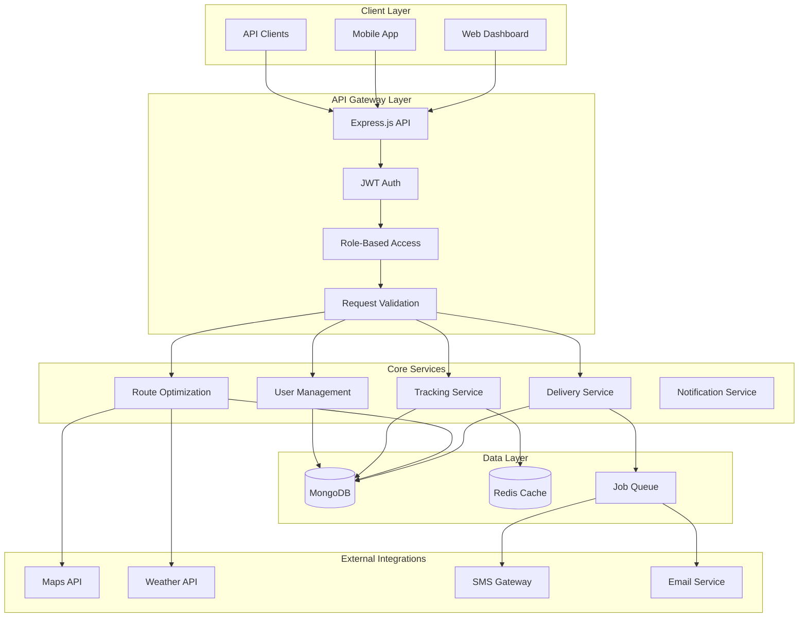
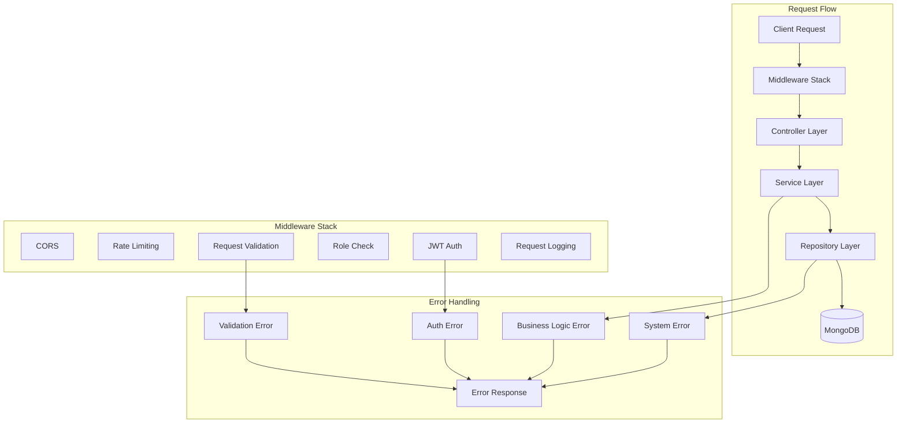

# 🚚 Logistics Management Backend API

A production-ready logistics management system built with **Node.js**, **Express**, and **MongoDB**. This enterprise-grade platform provides real-time delivery tracking, intelligent route optimization, and comprehensive role-based access control for modern logistics operations.

## ✨ Core Features

- **Real-time Delivery Tracking** - Live GPS tracking with status updates and ETA calculations
- **Intelligent Route Optimization** - AI-powered route planning with traffic and weather considerations
- **Multi-Role Access Control** - Admin, Planner, and Driver roles with granular permissions
- **RESTful API Architecture** - Clean, documented endpoints with comprehensive error handling
- **MongoDB Integration** - Scalable NoSQL database with optimized queries and indexing
- **JWT Authentication** - Secure token-based authentication with role-based authorization
- **Docker Deployment** - Containerized environment with Docker Compose for easy deployment
- **CI/CD Ready** - GitHub Actions workflow for automated testing and deployment

## 🏗️ Architecture & Design Patterns

### High-Level System Architecture


```mermaid
graph TB
    subgraph "Client Layer"
        WEB[Web Dashboard]
        MOBILE[Mobile App]
        API_CLIENT[API Clients]
    end

    subgraph "API Gateway Layer"
        EXPRESS[Express.js API]
        AUTH[JWT Auth]
        RBAC[Role-Based Access]
        VALIDATION[Request Validation]
    end

    subgraph "Core Services"
        DELIVERY[Delivery Service]
        ROUTING[Route Optimization]
        TRACKING[Tracking Service]
        USER[User Management]
        NOTIFICATION[Notification Service]
    end

    subgraph "Data Layer"
        MONGODB[(MongoDB)]
        REDIS[(Redis Cache)]
        QUEUE[Job Queue]
    end

    subgraph "External Integrations"
        MAPS[Maps API]
        WEATHER[Weather API]
        SMS[SMS Gateway]
        EMAIL[Email Service]
    end

    WEB --> EXPRESS
    MOBILE --> EXPRESS
    API_CLIENT --> EXPRESS

    EXPRESS --> AUTH
    AUTH --> RBAC
    RBAC --> VALIDATION
    VALIDATION --> DELIVERY
    VALIDATION --> ROUTING
    VALIDATION --> TRACKING
    VALIDATION --> USER

    DELIVERY --> MONGODB
    ROUTING --> MONGODB
    TRACKING --> MONGODB
    USER --> MONGODB

    ROUTING --> MAPS
    ROUTING --> WEATHER
    TRACKING --> REDIS

    DELIVERY --> QUEUE
    QUEUE --> SMS
    QUEUE --> EMAIL
```

### Role-Based Access Control Matrix

| Role        | Delivery Management | Route Planning | Driver Management | User Management | Analytics       | System Settings |
| ----------- | ------------------- | -------------- | ----------------- | --------------- | --------------- | --------------- |
| **Driver**  | View Assigned       | View Routes    | Profile Only      | None            | Personal Stats  | None            |
| **Planner** | Create & Update     | Full Access    | View All          | View Drivers    | Route Analytics | None            |
| **Admin**   | Full Access         | Full Access    | Full Access       | Full Access     | Full Analytics  | Full Access     |

### API Architecture Patterns


```mermaid
graph TB
    subgraph "Request Flow"
        CLIENT[Client Request]
        MIDDLEWARE[Middleware Stack]
        CONTROLLER[Controller Layer]
        SERVICE[Service Layer]
        REPOSITORY[Repository Layer]
        DATABASE[(MongoDB)]
    end

    subgraph "Middleware Stack"
        CORS[CORS]
        RATE_LIMIT[Rate Limiting]
        AUTH[JWT Auth]
        RBAC[Role Check]
        VALIDATION[Request Validation]
        LOGGING[Request Logging]
    end

    subgraph "Error Handling"
        VALIDATION_ERROR[Validation Error]
        AUTH_ERROR[Auth Error]
        BUSINESS_ERROR[Business Logic Error]
        SYSTEM_ERROR[System Error]
        RESPONSE[Error Response]
    end

    CLIENT --> MIDDLEWARE
    MIDDLEWARE --> CONTROLLER
    CONTROLLER --> SERVICE
    SERVICE --> REPOSITORY
    REPOSITORY --> DATABASE

    VALIDATION --> VALIDATION_ERROR
    AUTH --> AUTH_ERROR
    SERVICE --> BUSINESS_ERROR
    REPOSITORY --> SYSTEM_ERROR

    VALIDATION_ERROR --> RESPONSE
    AUTH_ERROR --> RESPONSE
    BUSINESS_ERROR --> RESPONSE
    SYSTEM_ERROR --> RESPONSE
```

## 🚀 Quick Start

### Prerequisites

- **Node.js** 18+
- **MongoDB** 6.0+
- **Redis** 7.0+ (optional, for caching)
- **Docker** & **Docker Compose** (for containerized deployment)

### Installation

#### Option 1: Local Development

```bash
# Clone the repository
git clone https://github.com/your-username/logistics-backend.git
cd logistics-backend

# Install dependencies
npm install

# Set up environment variables
cp .env.example .env
# Edit .env with your configuration

# Start MongoDB (if not running)
mongod

# Run the application
npm run dev
```

#### Option 2: Docker Deployment

```bash
# Clone the repository
git clone https://github.com/your-username/logistics-backend.git
cd logistics-backend

# Start all services with Docker Compose
docker-compose up -d

# View logs
docker-compose logs -f
```

### Environment Variables

Create a `.env` file in the root directory:

```env
# Server Configuration
NODE_ENV=development
PORT=3000
API_VERSION=v1

# Database Configuration
MONGODB_URI=mongodb://localhost:27017/logistics
MONGODB_URI_TEST=mongodb://localhost:27017/logistics-test

# JWT Configuration
JWT_SECRET=your-super-secret-jwt-key
JWT_EXPIRES_IN=24h
JWT_REFRESH_EXPIRES_IN=7d

# Redis Configuration (Optional)
REDIS_URL=redis://localhost:6379

# External APIs
GOOGLE_MAPS_API_KEY=your-google-maps-api-key
WEATHER_API_KEY=your-weather-api-key

# Email Configuration
SMTP_HOST=smtp.gmail.com
SMTP_PORT=587
SMTP_USER=your-email@gmail.com
SMTP_PASS=your-app-password

# SMS Configuration
TWILIO_ACCOUNT_SID=your-twilio-sid
TWILIO_AUTH_TOKEN=your-twilio-token
TWILIO_PHONE_NUMBER=your-twilio-number

# Rate Limiting
RATE_LIMIT_WINDOW_MS=900000
RATE_LIMIT_MAX_REQUESTS=100
```

## 📡 API Reference

### Authentication Endpoints

```http
POST /api/v1/auth/login
POST /api/v1/auth/register
POST /api/v1/auth/refresh
POST /api/v1/auth/logout
GET  /api/v1/auth/profile
```

### Delivery Management

```http
GET    /api/v1/deliveries              # List all deliveries
POST   /api/v1/deliveries              # Create new delivery
GET    /api/v1/deliveries/:id          # Get delivery details
PUT    /api/v1/deliveries/:id          # Update delivery
DELETE /api/v1/deliveries/:id          # Delete delivery
PATCH  /api/v1/deliveries/:id/status   # Update delivery status
```

### Route Optimization

```http
POST   /api/v1/routes/optimize         # Optimize delivery routes
GET    /api/v1/routes                  # Get all routes
GET    /api/v1/routes/:id              # Get route details
PUT    /api/v1/routes/:id              # Update route
DELETE /api/v1/routes/:id              # Delete route
```

### Real-time Tracking

```http
GET    /api/v1/tracking/:deliveryId    # Get delivery tracking
POST   /api/v1/tracking/:deliveryId    # Update delivery location
GET    /api/v1/tracking/eta/:deliveryId # Get ETA calculation
```

### User Management

```http
GET    /api/v1/users                   # List all users
POST   /api/v1/users                   # Create new user
GET    /api/v1/users/:id               # Get user details
PUT    /api/v1/users/:id               # Update user
DELETE /api/v1/users/:id               # Delete user
PATCH  /api/v1/users/:id/role          # Update user role
```

### Example API Usage

#### Create a New Delivery

```bash
curl -X POST http://localhost:3000/api/v1/deliveries \
  -H "Authorization: Bearer YOUR_JWT_TOKEN" \
  -H "Content-Type: application/json" \
  -d '{
    "pickupAddress": "123 Main St, City, State",
    "deliveryAddress": "456 Oak Ave, City, State",
    "customerName": "John Doe",
    "customerPhone": "+1234567890",
    "packageWeight": 5.5,
    "priority": "high",
    "assignedDriver": "driver_id_here"
  }'
```

#### Optimize Routes

```bash
curl -X POST http://localhost:3000/api/v1/routes/optimize \
  -H "Authorization: Bearer YOUR_JWT_TOKEN" \
  -H "Content-Type: application/json" \
  -d '{
    "deliveries": ["delivery_id_1", "delivery_id_2", "delivery_id_3"],
    "optimizationCriteria": ["distance", "time", "fuel"],
    "constraints": {
      "maxRouteTime": 480,
      "vehicleCapacity": 1000
    }
  }'
```

#### Update Delivery Status

```bash
curl -X PATCH http://localhost:3000/api/v1/deliveries/delivery_id/status \
  -H "Authorization: Bearer YOUR_JWT_TOKEN" \
  -H "Content-Type: application/json" \
  -d '{
    "status": "in_transit",
    "location": {
      "latitude": 40.7128,
      "longitude": -74.0060
    },
    "notes": "Package picked up successfully"
  }'
```

## 📁 Project Structure

```
logistics-backend/
├── src/
│   ├── controllers/           # Request handlers and response formatting
│   │   ├── auth.controller.ts
│   │   ├── delivery.controller.ts
│   │   ├── route.controller.ts
│   │   ├── tracking.controller.ts
│   │   └── user.controller.ts
│   ├── services/              # Business logic and external integrations
│   │   ├── auth.service.ts
│   │   ├── delivery.service.ts
│   │   ├── route.service.ts
│   │   ├── tracking.service.ts
│   │   ├── notification.service.ts
│   │   └── optimization.service.ts
│   ├── models/                # MongoDB schemas and data models
│   │   ├── user.model.ts
│   │   ├── delivery.model.ts
│   │   ├── route.model.ts
│   │   └── tracking.model.ts
│   ├── middleware/            # Express middleware functions
│   │   ├── auth.middleware.ts
│   │   ├── rbac.middleware.ts
│   │   ├── validation.middleware.ts
│   │   ├── error.middleware.ts
│   │   └── rate-limit.middleware.ts
│   ├── routes/                # API route definitions
│   │   ├── auth.routes.ts
│   │   ├── delivery.routes.ts
│   │   ├── route.routes.ts
│   │   ├── tracking.routes.ts
│   │   └── user.routes.ts
│   ├── utils/                 # Utility functions and helpers
│   │   ├── database.utils.ts
│   │   ├── validation.utils.ts
│   │   ├── response.utils.ts
│   │   └── logger.utils.ts
│   ├── config/                # Configuration files
│   │   ├── database.config.ts
│   │   ├── jwt.config.ts
│   │   └── app.config.ts
│   └── types/                 # TypeScript type definitions
│       ├── delivery.types.ts
│       ├── user.types.ts
│       └── api.types.ts
├── tests/                     # Test files
│   ├── unit/
│   ├── integration/
│   └── e2e/
├── docs/                      # Documentation
│   ├── api.md
│   └── deployment.md
├── docker/                    # Docker configuration
│   ├── Dockerfile
│   └── docker-compose.yml
├── scripts/                   # Build and deployment scripts
│   ├── build.sh
│   └── deploy.sh
├── .github/                   # GitHub Actions workflows
│   └── workflows/
│       ├── ci.yml
│       └── deploy.yml
├── .env.example              # Environment variables template
├── package.json              # Dependencies and scripts
├── tsconfig.json             # TypeScript configuration
├── jest.config.js            # Jest testing configuration
└── README.md                 # This file
```

## 🧪 Testing

### Running Tests

```bash
# Run all tests
npm test

# Run tests in watch mode
npm run test:watch

# Run tests with coverage
npm run test:coverage

# Run specific test suites
npm run test:unit
npm run test:integration
npm run test:e2e
```

### Test Structure

- **Unit Tests**: Test individual functions and methods
- **Integration Tests**: Test API endpoints and database operations
- **E2E Tests**: Test complete user workflows

## 🚀 Deployment

### Production Deployment

#### Option 1: Docker Deployment

```bash
# Build and deploy with Docker Compose
docker-compose -f docker-compose.prod.yml up -d

# Scale services
docker-compose -f docker-compose.prod.yml up -d --scale app=3
```

#### Option 2: Manual Deployment

```bash
# Install dependencies
npm ci --only=production

# Build the application
npm run build

# Start the application
npm start
```

### Environment-Specific Configurations

```bash
# Development
NODE_ENV=development npm run dev

# Staging
NODE_ENV=staging npm start

# Production
NODE_ENV=production npm start
```

## 🔧 Development

### Available Scripts

```bash
npm run dev          # Start development server with hot reload
npm run build        # Build for production
npm start            # Start production server
npm run lint         # Run ESLint
npm run lint:fix     # Fix ESLint errors
npm run format       # Format code with Prettier
npm run test         # Run tests
npm run test:watch   # Run tests in watch mode
npm run test:coverage # Run tests with coverage
npm run migrate      # Run database migrations
npm run seed         # Seed database with sample data
```

### Code Style

This project follows strict TypeScript and ESLint rules:

- **TypeScript**: Strict mode enabled with no implicit any
- **ESLint**: Airbnb style guide with custom rules
- **Prettier**: Consistent code formatting
- **Pre-commit hooks**: Automatic linting and formatting

### Database Migrations

```bash
# Create a new migration
npm run migrate:create -- --name add_delivery_tracking

# Run pending migrations
npm run migrate:up

# Rollback last migration
npm run migrate:down
```

## 🤝 Contributing

We welcome contributions! Please follow these steps:

### 1. Fork the Repository

```bash
git clone https://github.com/your-username/logistics-backend.git
cd logistics-backend
```

### 2. Create a Feature Branch

```bash
git checkout -b feature/amazing-feature
```

### 3. Make Your Changes

- Write clean, documented code
- Add tests for new functionality
- Update documentation as needed
- Follow the existing code style

### 4. Test Your Changes

```bash
npm run lint
npm test
npm run test:coverage
```

### 5. Submit a Pull Request

- Provide a clear description of your changes
- Include any relevant issue numbers
- Ensure all tests pass
- Update documentation if needed

### Development Guidelines

- **Code Style**: Follow TypeScript best practices and ESLint rules
- **Testing**: Maintain >90% test coverage
- **Documentation**: Update API documentation for new endpoints
- **Commits**: Use conventional commit messages
- **Reviews**: All PRs require at least one review

## 📊 Performance & Monitoring

### Performance Metrics

- **Response Time**: <200ms for 95% of requests
- **Throughput**: 1000+ requests/second
- **Uptime**: 99.9% availability
- **Error Rate**: <0.1% error rate

### Monitoring & Logging

```typescript
// Structured logging example
logger.info("Delivery created", {
  deliveryId: delivery.id,
  customerName: delivery.customerName,
  priority: delivery.priority,
  userId: req.user.id,
});
```

### Health Checks

```http
GET /api/v1/health          # Basic health check
GET /api/v1/health/detailed # Detailed system status
```

## 🔒 Security

### Security Features

- **JWT Authentication**: Secure token-based authentication
- **Role-Based Access Control**: Granular permissions system
- **Input Validation**: Comprehensive request validation
- **Rate Limiting**: Protection against abuse
- **CORS Configuration**: Secure cross-origin requests
- **Helmet.js**: Security headers
- **SQL Injection Protection**: MongoDB with parameterized queries

### Security Best Practices

- Store sensitive data encrypted
- Use environment variables for secrets
- Implement proper error handling
- Regular security audits
- Keep dependencies updated

## 📈 Roadmap

### Upcoming Features

- [ ] **Real-time Notifications**: WebSocket integration for live updates
- [ ] **Advanced Analytics**: Delivery performance metrics and insights
- [ ] **Mobile API**: Optimized endpoints for mobile applications
- [ ] **Multi-language Support**: Internationalization (i18n)
- [ ] **Webhook Integration**: Third-party service integrations
- [ ] **Advanced Route Optimization**: Machine learning-based routing
- [ ] **Driver App API**: Dedicated endpoints for driver applications

### Performance Improvements

- [ ] **Redis Caching**: Implement Redis for frequently accessed data
- [ ] **Database Optimization**: Query optimization and indexing
- [ ] **CDN Integration**: Static asset delivery optimization
- [ ] **Load Balancing**: Horizontal scaling support

## 📞 Support

### Getting Help

- **Documentation**: Check the `/docs` folder for detailed guides
- **Issues**: Report bugs and request features via GitHub Issues
- **Discussions**: Join community discussions on GitHub Discussions
- **Email**: Contact us at support@logistics-backend.com

### Community

- **GitHub**: [https://github.com/your-username/logistics-backend](https://github.com/your-username/logistics-backend)
- **Discussions**: [https://github.com/your-username/logistics-backend/discussions](https://github.com/your-username/logistics-backend/discussions)
- **Wiki**: [https://github.com/your-username/logistics-backend/wiki](https://github.com/your-username/logistics-backend/wiki)

## 📄 License

This project is licensed under the MIT License - see the [LICENSE](LICENSE) file for details.

### License Summary

```
MIT License

Copyright (c) 2024 Logistics Backend

Permission is hereby granted, free of charge, to any person obtaining a copy
of this software and associated documentation files (the "Software"), to deal
in the Software without restriction, including without limitation the rights
to use, copy, modify, merge, publish, distribute, sublicense, and/or sell
copies of the Software, and to permit persons to whom the Software is
furnished to do so, subject to the following conditions:

The above copyright notice and this permission notice shall be included in all
copies or substantial portions of the Software.

THE SOFTWARE IS PROVIDED "AS IS", WITHOUT WARRANTY OF ANY KIND, EXPRESS OR
IMPLIED, INCLUDING BUT NOT LIMITED TO THE WARRANTIES OF MERCHANTABILITY,
FITNESS FOR A PARTICULAR PURPOSE AND NONINFRINGEMENT. IN NO EVENT SHALL THE
AUTHORS OR COPYRIGHT HOLDERS BE LIABLE FOR ANY CLAIM, DAMAGES OR OTHER
LIABILITY, WHETHER IN AN ACTION OF CONTRACT, TORT OR OTHERWISE, ARISING FROM,
OUT OF OR IN CONNECTION WITH THE SOFTWARE OR THE USE OR OTHER DEALINGS IN THE
SOFTWARE.
```

## 🙏 Acknowledgments

- **Express.js** - Fast, unopinionated web framework
- **MongoDB** - NoSQL database for scalable data storage
- **JWT** - JSON Web Tokens for secure authentication
- **Docker** - Containerization platform
- **GitHub Actions** - CI/CD automation
- **TypeScript** - Type-safe JavaScript development

---

**Built with ❤️ using Node.js, Express, MongoDB, and TypeScript**
